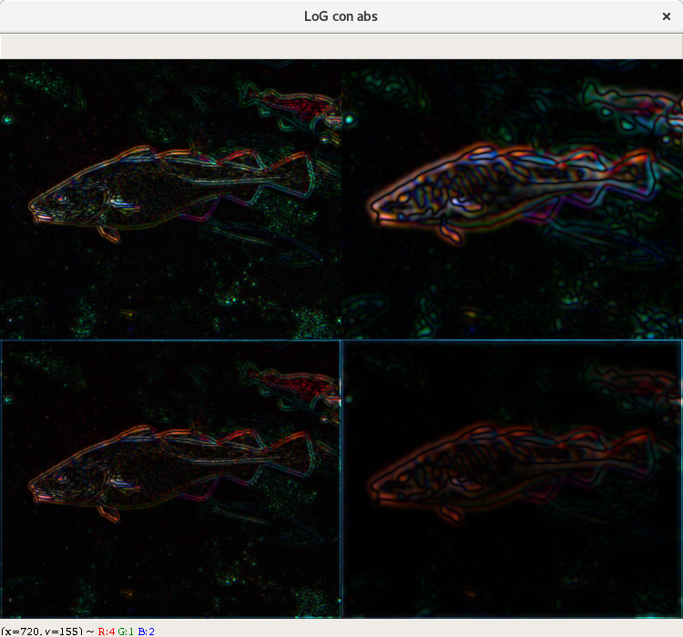
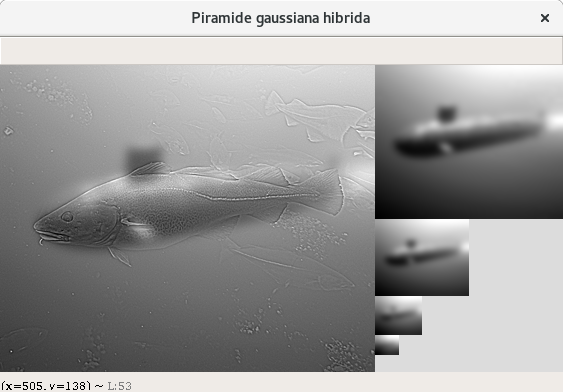
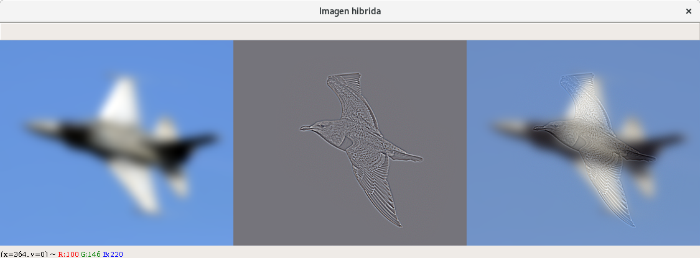

# Práctica 1 - Visión por Computador
## Miguel Lentisco Ballesteros

## Consideraciones previas

Antes de explicar los ejercicios explicaré una serie de cosas:
  - Funciones auxiliares:
    - `es_plana`: nos dice si la imagen está plana (su forma es `(filas, columnas)`)
    - `normalizar`: normaliza los valores de la imagen en el intervalo `[0,1]`
    - `reescalar`: normaliza la imagen y la escala al intervalo `[0, 255]` con tipo `int` preparada para mostrarse por pantalla. Se puede elegir si se toman los valores absolutos (útil para las laplaciana de gaussiana)
    - `muestraImagen`: muestra la imagen por pantalla, que hasta que no se pulsa una tecla no desaparece.

  - Como para el bonus1 hay que implementar la convolución con máscaras separables, no he usado `cv2.Filter2D` pero como la convolución a mano tarda, he hecho una versión que usa `np.convolve` y otra que no (la del bonus). Para toda la práctica menos el bonus1 se utiliza el método rápido, y en el bonus1 se hace un ejemplo del método hecho por mi entero. Por ello se utiliza una funcioón "interfaz" que es `filtro1D` (2 máscaras1D), por defecto usa `fast=True` que llama a la función rápida `convolve1Dfast`, si se pone `fast=False` entonces llama a la versión manual que es `convolve1Dbonus`.
  - Además también se ha hecho una función "interfaz" para las máscaras2D `filtro2D` de manera que si la máscara no es separable se llama a `convolve2D` (que en principio no va a ocurrir nunca ya que siempre trabajamos con máscaras separables) que la he implementado también a mano; y si es separable la descompone y llama a `filtro1D` según como esté el parametro `fast` (por defecto es `True`).
  - Cada ejercicio tiene su función, donde se llaman a subfunciones que corresponden a cada subapartado del ejercicio; se ha hecho así para hacer más fácil el no ejecutar todo e ir separando las cosas; excepto en el ejercicio 3 que lo he puesto todo junto.
  - Los ejercicios se pueden aplicar tanto a imagenes a color (tribanda) como escala de grises (monobanda), pero para que se apliquen bien al leer una imagen de grises hay que ponerla con dimension (filas, columnas, 1) esto se consigue haciendo `img = img[:, :, None]`.
  - Los ejemplos para los ejercicios 1 y 2 incluyen una imagen en escala de grises y otra en color para comprobar que todo se efectua correctamente.
  - `replicate` el modo de borde de OpenCV equivale en mi código a `edge`, en esta memoria se usará `replicate` pero al ver el código se tenga en mente que se refiere a `edge`.
  - Para `getDerivKernels` siempre voy a usar `mask_size=5`, ya que el tamaño está restringido a unos cuantos `3, 5, ...` y no parece que haya diferencias significativas entre ellos, así que he cogido 5 por tomar uno.

## Bonus 1
Queremos tomar una máscara2D separable, separarla y aplicar la convolución1D por filas y columnas con cada máscara1D respectivamente.

Para ello llamamos a la función `filtro2D` con la imagen, la máscara2D, el tipo de borde que se desea y con `fast=False`. Se comprueba que la máscara2D es separable: una matriz es separable si y solamente si su rango es 1; por lo que comprobamos que sea 1 con `np.linalg.matrix_rank` (descompone y el rango es el nº de valores singulares distintos de 0 con cierta tolerancia).

Comprobado que es separable, queremos separar la máscara2D y para ello llamamos a `separarMatriz2D`, que usando la descomposición SVD `np.lingalg.svd` descomponemos la máscara2D en el producto de 3 matrices U, S, VT (`M = U * S * VT`) donde S es una matriz diagonal con los valores singulares de la máscara2D. Como era de rango 1, S tendrá un valor distinto de 0 en el índice (1, 1) y el resto será nulo; por ello si vemos por columnas `U = (u_1, ..., u_n)` y `VT = (v_1T, ..., v_nT)`, al hacer el producto nos queda que la máscara2D `M` se expresa así: `M = s_1 * u_1 * v_1T`, por lo que tomando `u = u_1/sqrt(s1)` y `v = v_1T/sqrt(s1)` ya tenemos que `M = u * v` y por tanto ya tenemos nuestras dos máscaras1D.

Ahora aplicamos la convolución1D por filas y columnas con cada máscara1D con la función `filtro1D` que le hemos dicho que sea `fast=False` por lo que llama a `convolve1Dbonus`. Primero rellenamos la imagen según el `modo_borde` elegido con `rellenar`, he implementado manualmente 3 modos distintos `edge` (`replicate` en OpenCv), `constant` y `reflect`; si se llama a otro distinto como `wrap` o `mean`, etc. se llama a `np.pad`. Después vamos por cada fila de la matriz rellenada tomando el tamaño de la máscara1D y aplicando la multiplicación elemento a elemento con la máscara1D al revés (`np.flip`) sumando el resultado y poniendolo como valor en el pixel correspondiente; y repetimos la misma operación pero tomando ahora las columnas. Finalmente devolvemos el resultado quitandole el relleno que le pusimos.

Para poner a prueba esto, vamos a aplicar una gaussiana con `sigma=0.2` a una imagen y con borde `reflect`, de manera que pasemos a `filter2D` la máscara2D del filtro gaussiano y comparemos con `cv2.GaussianBlur` los resultados.

A la izquierda con `filtro2D`, a la derecha con `GaussianBlur`.

Como podemos comprobar el resultado es muy similar aunque claro con la diferencia de tiempo, mientras que el modo rápido es casi instantáneo, mi implementación tarda un par de segundos. Esto es debido a que `convolve` está escrito en C y que usa la Transformada Rápida de Fourier para hacer las cuentas en el dominio de frequencias donde la convolución se vuelve producto escalar, haciendo el cálculo mucho más rápido.

## Ejercicio 1

### 1. Filtros gaussianos y derivadas
Vamos a querer ver convoluciones de una imagen con máscaras2D separables, donde usaremos los filtros gaussianos y los de derivadas con unos cuantos ejemplos.

Sabemos que ya que con `filtro2D` podemos pasarle una máscara2D separable (o no, pero trabajaremos siempre con separables) para hacer la convolución y con `filtro1D` si tenemos ya las dos máscaras1D (se usa lo explicado en el bonus1 pero usando las funciones rápidas).

Para aplicar la gaussiana, creamos una función que en base al sigma que le pasemos nos devuelva una máscara1D, sin más que usar ella misma como las dos podemos aplicar el filtro gaussiano. Partimos de la función gaussiana de dimensión con `mu_x=mu_y=0` y sigmas cualquiera, y vemos que se puede separar la x de la y (claro, ya que la distribución normal era independiente) por lo que podemos generar la de 2 dimensiones con la de 1 dimensión repetida (hacemos que `sigma_x = sigma_y`). Sin más que discretizar la función gaussiana tomando el intervalo `[-3 * sigma, 3 * sigma]` (95% del área bajo la función) cogemos todos los enteros del intervalo (que será impar: `6 * sigma + 1` elementos) les aplicamos a todos la función gaussiana y normalizamos el vector.

Pues esa máscara1D devuelve `getKernelGaussian`, pero para aplicar el filtro directamente podemos llamar a la función `aplicaGaussiana` donde le indicamos la imagen, el sigma y el modo de borde y nos devuelve la imagen aplicandole la máscara1D obtenida.

Por otro lado para las derivadas, podemos usar la función de OpenCV `cv2.getDerivKernels` donde hay que indicarle el grado de derivación de cada variable (x e y) y el tamaño de la máscara. Con `aplicaDeriv` le pasamos la imagen, los párametros que acabo de describir y el modo de borde y devuelve la imagen aplicada con el filtro de derivadas.

Ponemos todo esto a prueba en `ej11`, donde representamos primero aplicaciones de la gaussiana con distintos párametros. En la siguiente cuadrícula tenemos:
  - Izquierda: `sigma=1.0`
  - Derecha: `sigma=3.0`
  - Arriba: `borde=replicate`
  - Abajo: `borde=constant`

Como podemos comprobar al aplicar el filtro gaussiano se nota que la imagen se vuelve menos nítida, como si estuviera desenfocada; además los colores también se amortiguan. Obviamente a mayor sigma, mayor es este efecto como vemos entre derecha e izquierda.

Por otro lado se nota bastante el efecto abajo de haber usado un borde `constant` (de valor 0) viendo un especie de marco alrededor de la imagen mientras que arriba con `replicate` no ocurre esto, los bordes se ven naturales.

Se han escogido estos parámetros para que se vea claramente el efecto de cambiar el sigma y el cambio drástico de usar un tipo de borde constante con otro que usa el entorno próximo al borde.

Ahora probemos las derivadas con la siguiente cuadrícula (dx, dy indican el nº de veces que se deriva) con `mask_size=5` fijo:
  - Izquierda: `dx1=1 dy=0`
  - Derecha: `dx=0 dy=0`
  - Arriba: `borde=replicate`
  - Abajo: `borde=constant`

Como vemos, al aplicar la derivada de primer orden en una variable solo se nos queda una imagen como con relieve donde se acentúan mucho los bordes y además lo hacen en una dirección, en el caso de la `x` es verticalmente y con la `y` es horizontalmente.

El uso del borde `constant` aqui ya se nota mucho mas, creando un borde "feo" que encima comparando vemos que hace que la imagen sea más "apagada" de manera que los bordes no resaltan tanto; mientras que con `replicate` que una versión mucho más agradable de ver.

Además en el caso de la imagen con color, salen distintos colores en cada una, sugiriendonos que igual al hacer uso de derivadas sería mejor para visualizarla la escala de grises pero por experimentar y ver lo que sale seguiremos usando imágenes a color.

Los parámetros están escogidos para ver la diferencia entre hacer la derivada en una variable y en la otra, y como el uso de un borde empieza a ser fundamental, y que no deberíamos de usar `constant` más.

## 2) Laplaciana de gaussiana
Tenemos que implementar la laplaciana de la gaussiana y ver unos ejemplos, para ello primero implementaremos la laplaciana y luego la laplaciana de gaussiana (LoG).

La laplaciana de una función de dos variables se define como la suma de las segundas derivadas respecto cada variable, para implementar podemos hacer uso de `aplicaDeriv` que deriva una imagen. Tendremos que hacer lo siguiente: `Lap(f) = f * dx2 + f * dy2` donde f es una imagen/función cualquiera y `dx2=getDerivKernels(2,0)` e `dy2=getDerivKernels(0,2)`. Podríamos sacar factor común f pero como la suma de máscaras separables en general no es una máscara separable, vamos a dejarla así para poder efectuar las convoluciones separables.

Lo que he indicado se implementa en `laplaciana` y para aplicar la laplaciana de gaussiana, que usaremos con `aplicaLoG`, es con la imagen aplicarle primero el filtro gaussiano y después pasarsela a `laplaciana` donde finalmente normalizaremos multiplicando por `sigma^2`.

Como en la LoG vamos a querer apreciar los bordes vamos a querer buscar los valores más altos en valor absoluto, por ello mostraré los resultados tanto con como sin tomar valores absolutos para ver las diferencias.

Probamos la LoG con la siguiente cuadrícula con `mask_size=5` fijo:
  - Izquierda: `sigma=1.0`
  - Derecha: `sigma=3.0`
  - Arriba: `borde=replicate`
  - Abajo: `borde=constant`

Queda en evidencia que al usar abajo `constant` al crear un borde negro estamos ya alterando una barbaridad la imagen haciendo que el resto de la imagen se quede asi en blanco, así que lo que ya veniamos viendo de antes queda zanjado, se prefiere otro uso de bordes mejor como `replicate` o `reflect`.

Por otro lado también vemos que aunque sin tomar valor absoluto sep ueden apreciar los bordes y el relieve, hay zonas que se pierden y otras que destacan mucho más de lo que deberían cuando no tomamos valor absoluto. Sin embargo al tomar valor absoluto queda mucho mejor y claro donde están los bordes (zonas iluminadas) y donde no (zonas oscuras), además de que con la imagen a color sigue habiendo cierto problema con el color pero ahora se visualiza mucho mejor. En cualquier caso nos indica que deberíamos usar el valor absoluto para apreciar los bordes.

Finalmente, al igual que anteriormente al subir el sigma la imagen se volvia más borrosa/difuminada aquí pasa igual, pero si nos fijamos en los resultados con valor absoluto, cuanto menos sigma más parece que se resalten los bordes con más detalle (por ej en el gato los puntos del rostro, los bigotes,...) pero al aumentarlo van desapareciendo y van quedando los bordes que son más grandes (ojos por ej), esto nos va dando la noción de los detalles a escala.

Los parámetros de sigma se indicaban en el enunciado y los tipo de borde dejan claro la diferencia entre usar un borde "bueno" (que usa la continuidad espacial) frente a otro que no "constant".

## Ejercicio 2

### 1. Pirámide gaussiana
Tenemos que crear una pirámide gaussiana de 4 niveles, que sabemos consta de subsamplear y aplicar gaussiana.

Como tenemos que hacer subsampling implementamos la función `downsampling` que se le indica el ratio de columas y filas al que debe hacer downsampling, por ejemplo, querer la mitad de la imagen sería `ratio=2`, un tercio sería `ratio=3`... Simplemente se itera la imagen haciendo saltos según indique `ratio`.

Implementamos la piramide con `piramideGaussiana`, donde se considera que la imagen original está incluida pero cuenta como nivel 0, por tanto se devolverá una lista de `niveles + 1` imágenes. De manera sencilla incluimos primero la imagen original y repetimos `niveles` veces coger la última imagen de la lista, aplicarle un filtro gaussiano y el `downsampling` con `ratio=2`; donde guardamos el resultado en la lista.

Como las imágenes no van a ser del mismo tamaño, usaremos una función para dejar lista para imprimir en pantalla llamada `crearPiramideImagen` que usa un borde de color fijo `220` y pone la pirámide en forma de escalera.

Usaremos la siguiente cuadrícula con `sigma=1.5` y `mask_size⁼5` fijos:
  - Arriba: `borde=reflect`
  - Abajo: `borde=replicate`

Como podemos ver tenemos la imagen original a la izquierda, y después las submuestras a la izquierda en escalera, se puede apreciar que las imágenes a pesar de que se hagan cada vez más chicas son "agradables" de ver, no presentan borrosidad, y mantienen un aspecto de nitidez bastante bueno al compararlo con la original.

A diferencia de antes, ahora usamos `reflect` y `replicate` como modos de borde y aparentemente no producen ninguna diferencia significativa todo lo contrario cuando usabamos `constant`.

Se ha fijado un sigma bajo para que no emborrone mucho y se mantenga la nitidez, y los bordes para ver que con dos tipos que usan la continuidad espacial parece que con filtros gaussianos producen el mismo resultado al menos visualmente.

### 2. Piramide Laplaciana
Tenemos que crear una pirámide laplaciana de 4 niveles, que para construirla se basa en la piramide gaussiana y usando diferencias. Es decir toma un nivel de la gaussiana y le resta el upsampling del siguiente nivel de la gaussiana.

Por tanto tenemos que implementar `upsampling`, que se encarga de aumentar la imagen sin más que repetir tantas veces como el ratio que se le pase, las filas y columnas.

Implementamos la piramide con `piramideLaplaciana`, que para construirla primero construimos la piramide gaussiana con los mismos niveles (pero como tiene la original será más 1) y repetimos para tantas veces como niveles haya que hacer, coger el i-ésimo nivel de la gaussiana y restarselo al (i+1)-ésimo nivel de la gaussiana aplicandole `upsampling`. Como es posible que la imagen no fuese múltiplo en un principio, al hacer upsampling puede que las dimensiones ahora no coincidan, por ello usamos interpolación con `cv2.resize` (solo si las dimensiones al hacer upsampling no coinciden).

Hacemos igual que en la gaussiana, fijamos `sigma=1.5` y `mask_size=5`:
  - Arriba: `borde=reflect`
  - Abajo: `borde=replicate`
  - Derecha: `v_abs=False`
  - Izquierda: `v_abs=True`

Vemos que la pirámide laplaciana efectivamente se comporta como vimos en el ejercicio de LoG, hace el mismo efecto, acentuando los bordes (mejor de ver en la versión con valor absoluto). La primera imagen de la laplaciana como usaba la original sin pasarle un filtro gaussiano es el que más diferencia tiene respecto las otras ya que no se le había "quitado" el ruido y se nota ya que en las sucesivas imágenes el color de los ojos por ejemplo es más intenso.

En cualquier caso, parece que se ve bien a pesar del downsampling, y que se comporta como si estuvieramos haciendo LoG. Además no hay diferencias significativas en cuanto a usar un tipo de borde `reflect` o `replicate` como ya veníamos viendo desde la pirámide gaussiana.

Además me ha parecido conveniente comprobar que está bien, reconstruyendo la imagen original (que no es más que el nivel 0 de la pirámide gaussiana), tomando el último nivel de la pirámide gaussiana, haciendo upsampling, y sumandosela al último nivel de la pirámide laplaciana y el resultado aplicando la misma operación (basicamente haciendo la laplaciana pero desde abajo y sumando en vez de restar). Esto se implementa en `recuperarImagen` y para ver que está bien incluyo en una imagen puestas de este orden: la original, con `borde=reflect`y con `borde=edge`; y con `sigma=1.5` y `mask_size=5` fijos.

Efectivamente la imagen original se recupera perfectamente.

### 3. Escalas laplacianas
Tenemos que crear un espacio de escalas laplacianas, para poder aplicar la supresión de no-máximos y representar las regiones "importantes" mediante círculos proporcionales a la escala, es decir estamos haciendo "blob detection".

En `escalasLaplaciano` haremos esto y devolvermos la imagen original pintando en ella los círculos encontrados. Primero creamos las `n_escalas` escalas aplicando a la imagen la laplaciana de gaussiana con un sigma inicial, que cada vez que creamos otra escala incrementamos multiplicandola por `1.4`; y elevando al cuadrado el resultado de la LoG. Además guardaremos las sigma de cada escala en una lista para poder usarlas al pintar los círculos.

Después por cada escala le aplicamos la supresión de no-máximos de manera que vamos a pasarle (cuando se pueda) la
escala superior e inferior, y lo hacemos en `supresionNoMaximos`: juntamos las tres escalas formando un cubo (en el caso de ser a color, juntamos 3 cubos y por cada canal tomamos un cubo) lo rellenamos de 0 para que por cada pixel
de la escala que queremos suprimir podamos tomar el subcubo de radio 3. Miramos el valor máximo de este subcubo y si es mayor estricto que el valor del píxel del centro del subcubo lo ponemos a 0 (en una copia).

**Nota**: por comodidad supongo que se vayan a pedir al menos 3 escalas.

Una vez terminado, por cada escala (reescalada a `[0,255]`) dibujamos en la imagen los puntos que superen un umbral terminado `UMBRAL` que he fijado en 124 (la mitad de 255) se pinta un círculo de radio proporcional a la escala, es decir que vale el sigma de la escala por una constante `K`, en principio debía ser `sqrt(2)` pero para mejor visualización la he cambiado por `2`.

**Nota2**: la función tarda un poco ya que hay que hacer muchas iteraciones en las imágenes y aun no estoy completamente familiarizado con la libreria `numpy` y se cuando tenga mayor manejo pueda cambiar los bucles for de
python por las iteradores que implementa en `C`, pero el tiempo es razonable así que espero que no pase nada.

**Nota3**: he cambiado la imagen del pez por el pájaro porque la del pez daba pocas zonas interesantes.

Veamos los siguientes ejemplos empezando con `sigma=1.2`, `borde=reflect`, `mask_size=5` y `n_escalas=6`:

  

  

Vemos las distintas escalas que se nos muestran en el gato, por un lado los círculos chicos son los que más se destacan con el sigma más bajo: bigotes, orejas, los bordes inferiores del ojo; y conforme aumenta sigma se rondean los ojos, el relieve exterior del gato y un trozo de la nariz. En efecto los bordes mas pronunciados.

En el pájaro vemos que los detalles más imporantes estan en los bordes derechos de las alas y por la cola; y al subir el nivel se destaca el pico, la pnta de las alas y de la cola, el ojo y los centros de las alas. Notamos que solo aparecen en el pájaro no fuera de él (como debería ser)

En ambos casos concuerdan con zonas o rasgos que destacan más sobre el resto de la imagen tanto en el gato (ojos, bigote, orejas) como en el pájaro (cola, punta de alas, cabeza, plumas diferentes).

He empezado por un sigma bajo `1.2` para obtener regiones pequeñas y multiplicado por `1.4` para que haya un poco de diferencia entre escalas y no se cancelen demasiado al hacer supresión (queremos que estén cercas las escalas para forzar encontrar los máximos pero sin quedarnos en escalas parecidas); y también llegar a regiones más grandes.

## Ejercicio 3

### 1. Hibridar
Se nos pide una función para hibridar dos imagenes y que se muestre por pantalla la baja, alta y la híbrida.

Como se nos indica en el paper, una función híbrida no es mas que la combinación de una imagen que se le ha pasado un filtro de paso alto con la suma de otra imagen que se le ha pasado un filtro de paso bajo. Un filtro de paso bajo se puede implementar un filtro gaussiano `G1`, y el de paso alto no es mas que el contrario de un paso bajo `1 - G2`.

Implementamos esto en `hibridar` donde tenemos que pasarle las dos imagenes, el sigma del filtro de paso bajo, y el de alto. Aplicamos a la primera imagen el filtro de paso bajo, y a la segunda imagen le restamos pasarle a la imagen el segundo filtro de paso bajo (convirtiendolo en alto). Reescalamos y mostramos por pantalla.

Ahora veremos los ejemplos en el apartado 2.

### 2. Ejemplos
Con las parejas de fotos que se nos han proporcionado (5 parejas) se ha intentado buscar la mejor sinergia posible en cada combinación, mediante muchas iteraciones de experimentación.

Las imágenes se muestran primero la de frecuencias bajas, altas y la híbrida.

- Gato y perro: para esta pareja coinciden los ojos, la cabeza en general, las orejas, la boca del perro con la nariz... así que se da una buena alineación. He decidido poner el perro como la del filtro alto ya que los cabellos que tiene y el morro grande hace que si están difuminados chocan mucho más, mientras que al no verse de lejos no se aprecia; por otro lado el gato encaja perfectamente con la silueta al acercarse ya que no hay.

  - Sigma bajo: 8.5
  - Sigma alto: 2.2

  

- Caza y pájaro: coinciden con las alas y el cuerpo, sin embargo el avión sobre sale más por delante y por atrás que el pájaro. Pongo el avión como bajo ya que si lo ponía como alto, quedaban partes que sobresalían sobre el pájaro y se pintaban ciertas zonas de manera extraña. Teniendo el pájaro como alta, al acercarte queda por encima del avión en la parte central y el avión queda como una especie de sombra, reflejo o incluso otro pájaro y el pájaro alto queda por encima de él sobrevolándolo.

  - Sigma bajo: 5.0
  - Sigma alto: 1.5

  

- Marilyn y Einstein: hay buena sinergia ya que los tamaños de la cabeza coinciden, el rostro en general tiene todo a la misma altura... Pongo a Einstein en alto y Marilyn en bajo ya que Marilyn se le ve el cuello y los hombros mientras que a Einstein no; esto hace que sea más facil de poner a Marilyn en el fondo, ya que esto junto al contorno de su pelo permite que al acercarnos se añada a Einstein perfectamente.

  - Sigma bajo: 5.0
  - Sigma alto: 1.5

  

- Pez y submarino: coinciden con la forma en general, larga y redondeada. Pongo el pez de alta ya que al ponerla de baja, la cara aun se podía percibir y además daba al submarino una mezcla de tonalidades distintas que hacía que no se viese bien; al ponerlo de alta como el submarino es uniforme el pez se ve bien, solo resalta un poco la escotilla del submarino pero no impide la buena visualización.

  - Sigma bajo: 5.0
  - Sigma alto: 1.0

  

- Moto y bici: coinciden el cuerpo general y las ruedas, aunque la bici tiene un hueco por el centro donde la moto no. El poner la moto de fondo haría que se viese un buen trozo de fondo que molesta bastante, al hacerlo al revés lo único que sobresale el sillín y el manillar un poco, pero con una buena difusión se queda atenuado y el resto del cuerpo de la moto se dislumbra bien de cerca.

  - Sigma bajo: 9.0
  - Sigma alto: 1.4

  

### 3. Pirámides gaussianas
Si intentamos hacer pirámides gaussianas, como estamos pasando un filtro gaussiano, que es un filtro de paso bajo entonces lo que vamos a hacer es atenuar muchísimo las frecuencias altas y dejar pasar las bajas. Como nuestra imagen era mezcla de una con frecuencias altas y otra con frecuencias bajas, lo que deberíamos obtener serán imágenes de la imagen con frecuencia baja (la que se ve de lejos, la borrosa).

Hacemos la pirámide con las 5 parejas.

- Gato y perro:

  

- Caza y pájaro:

  

- Marilyn y Einstein:

  

- Submarino y pez:

  

- Moto y bici:

  

Efectivamente, obtenemos una pirámide gaussiana de la imagen de frecuencias bajas, como si la alta nunca hubiera estado.

# Bonus 2
Ahora hay que mezclar las parejas pero con colores. Se sigue la misma metodología de experimentación con las parejas.

- Gato y perro: los colores se funden bien, sobre todo la nariz del gato rosita se mezcla bien con la boca rosita del perro, las orejas también, el pelaje... Se aplican valores casi iguales que con los grises.

  - Sigma bajo: 8.5
  - Sigma alto: 3.0

- Caza y pájaro: como ya comentaba, el avión difuminado de fondo parecía una proyección del pájaro en el mar (por ejemplo), esto gana credibilidad cuando los colores coinciden más o menos, haciendo que parece realmente que sea un reflejo del pájaro. Se aplican valores casi iguales que con los grises.

  - Sigma bajo: 8.0
  - Sigma alto: 1.1

- Merilyn y Einstein: como las imágenes a color eran en color gris/sepia ya no hay que hacer ajustes para que se vea bien. Se aplican los mismos valores que con los grises.

  - Sigma bajo: 5.0
  - Sigma alto: 1.5

- Pez y submarino: el color del pez que no es uniforme, provoca que si se pone de bajo y el submarino de alto, éste va a tener diferentes colores que resaltan demasiado y no causan la sensación que uno esperaría de ver un submarino. Al revés el color plano que tiene el submarino contrasta bien con el pez, por ello aplicamos los mismos valores que con los grises.

  - Sigma bajo: 5.0
  - Sigma alto: 1.0

- Moto y bici: el color rojo del cuerpo de la bici y la moto se complementan, y aprovechamos esto para que se resalten las figuras. Valores parecidos a los grises.

  - Sigma bajo: 7.0
  - Sigma alto: 2.0

## Bonus 3
Tenemos que buscar 2 imágenes que combienen bien para formar una imagen híbrida.

Mi primera aproximación comienza en buscar cosas que tengan cierto parecido en forma, tamaño, semejanza... y una de las cosas más faciles de ver es gente que se parezca. He tomado a José Luis Rodriguez Zapatero y a Rowan Atkinson, ya que son personas que se parecen mucho en su rostro, y he encontrado esta foto de los dos.

Podemos ver cierta similitud, pero para nuestra imagen hay ciertas cosas que no concuerdan como la cara ladeada de Zapatero, la corbata, el cuello, las distintas posiciones... por ello recortamos las imágenes de manera que cogemos los rostros de ambos, buscamos un cierto tamaño igual y reescalamos al mismo tamaño.

Para que la imágen híbrida salga bien es fundamental que haya una cierta alineación, por ello giro la cara de Zapatero hasta que se quede alineada de frente y subo y bajo y un poco a los dos para que haya una alineación del mismo nivel de rostro. El resultado de alineación es bastante bueno, y aporta mucha fuerza en la imágen híbrida.

Finalmente como Atkinson resalta mucho por sus ojos lo he tenido que poner de baja y a Zapatero en alta, usando los siguientes parámetros:

  - Sigma bajo: 6.0
  - Sigma alto: 2.0

  
