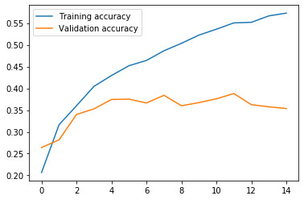

# VC - P2
## Miguel Lentisco Ballesteros

# Ejercicio 1
Para el ej1 usaremos el modelo básico `baseNetBasico` y sin preprocesador (`None`), por defecto los entrenamientos vienen con `batch_size = 32` y `epochs = 15`. Probemos que tal funciona:

`Acc: 0.4276`

Un acierto del casi 43%, pero querremos llegar por lo menos al 50%. Por otro lado, podemos ver que la curva de `validation loss` empieza a subir y alejarse de `training loss`, lo que nos indica que hay cierto overfitting.

Como aporte extra, pongamos un preprocesador de `ImageDataGenerator` para que haga el 10% de separación para el conjunto de validación (esto se pasaba como argumento)

`Acc: 0.3732`

Vemos que las funciones salen más "suaves" pero el comportamiento es similar al anterior, además de una pérdida de 5% de acierto.

En cualquier caso hay que arreglar ese overfitting, que se puede hacer facilmente añadiendo capas de Dropout.

# Ejercicio 2
Para el ej2 vamos a ir introduciendo mejoras al modelo básico para ver si podemos llegar a un acierto de al menos 50%.

Lo ideal será cuando las funciones de pérdida de validación y entrenamiento coincidan, así que buscaremos esto.

## Dropout
Hemos visto en el modelo base que hay overfitting (la pérdida en la validación sube y se separa mucho del training) así que pondremos capas de Dropout para evitar esto.

## Normalización datos
Para esta mejora simplemente normalizamos los datos de entrenamiento a media 0 y desviación típica 1 (se aplica la misma al conjunto test).

El resultado es el siguiente:

`Acc: 0.2628`

El resultado es bastante peor, y vemos como la curva del error empieza a diferenciarse mucho más de rápido que en el caso base. Probemos a poner solo 8 épocas antes de que empieze a subir.

`Acc: 0.326`

Hemos mejorado, pero sigue siendo peor que lo anterior, puede ser a que normalizemos la entrada pero no se haga normalización dentro de la red y por tanto nos den estos resultados raros.

Para evitar repetirnos, buscaremos todas las mejoras posibles y luego ya ajustaremos el nº de épocas.

## BatchNormalization
Probemos a añadir capas de BatchNormalization después de las capas Conv2D y después de las lineales (después de las ReLU) Este será el modelo `baseNetNormalizadoDespuesReLU`, que entrenaremos con lo predeterminado y el preprocesador básico (sin hacer nada).

`Acc: 0.4516`

Hemos conseguido una mejora en el acierto y además la curva de acierto de validación va mejorando (en la base no).

Probemos ahora poniendo la normalización antes de las ReLU.

`Acc: 0.4572`

Obtenemos un acierto casi igual aunque las curvas de validación salen mucho más "espinadas" por lo que nos quedaremos con la versión de normalización después de la ReLU.
