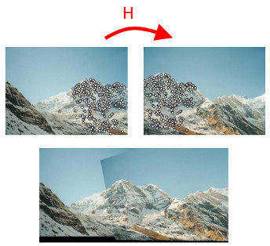

---
lang: es-ES
...

# VC - C3
## Miguel Lentisco Ballesteros

## Ejercicio 1

*¿Cuál es la transformación más fuerte de la geometría de una escena que puede introducirse al tomar una foto de ella? Dar algún ejemplo.*

La transformación geométrica más fuerte sería la **homografía**, puesto que en general, solo preserva las líneas rectas (lleva líneas en líneas) mientras que otras transformaciones más flojas como por ejemplo las afínes, además mantienen las líneas paralelas en líneas paralelas.

En este ejemplo vemos como aplicando una homografía se llevan rectas secantes (las horizontales) en rectas paralelas; y observamos que realmente es como observar el mismo objeto plano (la fachada) fotografíada desde dos puntos de vista distintos.

## Ejercicio 2

*¿Por qué es necesario usar el plano proyectivo para estudiar las transformaciones en las imágenes de fotos de escenas? Dar algún ejemplo.*

Estudiando las transformaciones en las imágenes de fotos de escenas, el problema más fuerte que nos surje es como tratar con la transformación geométrica que existe entre dos imágenes del mismo objeto plano tomadas desde 2 puntos de vista diferentes; como hemos visto en la *Figura 1*.

La solución es la transformación geométrica llamada **homografía**, que es un isomorfismo entre planos proyectivos en nuestro caso (objetos planos); por lo que surje que tengamos que usar el plano proyectivo.

Además, toda transformación afín se puede ver como una homografía (afín) por lo que al estudiar las transformaciones geométricas (afínes incluidas) estaríamos usamos el plano proyectivo siempre.

Entre los ejemplos encontramos la **corección de perspectiva** (*Figura 1*), **creación de mosaicos/panorámicas** o **realidad aumentada**; en todos tenemos que considerar la perspectiva de las fotos de la escena, por lo que hay que tener en cuenta el plano proyectivo para estudiar las homografías.

{ height=250px }

{ height=200px }

\newpage
## Ejercicio 3

*Sabemos que en el plano proyectivo un punto no existe en el sentido del plano afín, sino que se define por una clase de equivalencia de vectores definida por $\{k(x,y,1),k\neq0\}$. Razone usando las coordenadas proyectivas de los puntos afines de una recta que pase por el (0,0) del plano afín y verifique que los punto de la recta del infinito del plano proyectivo son necsariamente vectores del tipo (\*,\*,0) con \*=cualquier número.*

Mediante la clase de equivalencia vemos inmediatamente como pasar de coordenadas afines a proyectivas: si $(\frac{x}{z}, \frac{y}{z}) \in \mathbb{R}^2$ con $|z| \neq 0$ : $(\frac{x}{z}, \frac{y}{z}) = (\frac{x}{z}, \frac{y}{z}, 1) = (x,y,z) \in \mathbb{R}P^2$.

Sabemos que cualquier recta $R$ que pase por el origen en el plano afín se puede representar como los puntos que satisfacen cierta ecuación; fijamos $|a|,|b| \in \mathbb{R}^+$ y tenemos que: $R_{a,b} = \{(x,y) \in \mathbb{R}^2 : ax + by = 0\}$; denotamos $R = R_{a,b}$.

Parametrizamos $x = bt$, $y = -at$ y entonces $R = \{(bt, -at) \in \mathbb{R}^2 : t \in \mathbb{R} \}$. Ahora consideramos $z = \frac{1}{t}$, y tenemos que $R = \{(\frac{b}{z}, \frac{-a}{z}) \in \mathbb{R}^2 : |z| \in \mathbb{R}^+ \} \cup \{(0,0)\}$.

Pasamos ahora a coordenadas proyectivas: $R = \{(b,-a, z) \in \mathbb{R}P^2 : |z| \in \mathbb{R}^+ \} \cup \{(0, 0, 1)\}$. Nos damos cuenta de que con las coordenadas afínes si $z = 0$ $(\frac{b}{z}, \frac{-a}{z})$ no esta definido, pero con coordenadas proyectivas $(b, -a, z)$ sí, dándonos el punto $(b, -a, 0)$.

Este punto pertenece al plano proyectivo y **no** al plano afín, puesto que $(b, -a, 0) \notin R, \forall |a|, |b| \in \mathbb{R}^+$ y se tiene que $\forall (x,y) \in \mathbb{R}^2 \, \exists |a|,|b| \in \mathbb{R}^+ : (x,y) \in R$. Además recordamos que $z = \frac{1}{t}$ por lo que $z = 0$ cuando $t \rightarrow \infty$, lo que nos sugiere denominar a este punto $(b, -a, 0)$ como el punto de la recta $R$ "en el infinito".

Así, formamos la recta en el infinito como la unión de todos los puntos en el infinito obtenidas de todas las rectas afínes que pasen por el origen afín, por lo que tendríamos que $$R_{\infty} = \{(b, -a, 0) \in \mathbb{R}P^2 : |a|, |b| \in \mathbb{R}^+\} = \{(x,y,0) \in \mathbb{R}P^2 : x,y \in \mathbb{R} \}$$.

**Nota**: el punto (0, 0, 0) no existe y no se puede alcanzar nunca ya que $|a|, |b| \in \mathbb{R}^+ \iff a \neq 0 \neq b$.

## Ejercicio 4

*¿Qué propiedades de la geometría de un plano quedan invariantes cuando se toma una foto de él? Justificar la respuesta.*

Como ya hemos visto, al tomar una foto de un objeto plano desde varios puntos de vista se puede perder la mayoria de propiedades invariantes (ángulos, escalas, rectas paralelas...), las única invarianza que nos deja la transformación geométrica más general, la homografía, es la **preservación de lineas rectas y de puntos no alineados** (también denominado **colinealidad**).

Una homografía afín sabemos que no conserva ángulos, escalas, orientaciones, longitudes... pero si conserva el paralelismo (rectas paralelas), esto es porque la homografía lleva los puntos en el infinito (donde dos rectas paralelas se "cortan") en otros puntos en el infinito, de manera que como estos puntos no están en el afín las rectas paralelas siguen siendolo.

Por otro lado una homografía no afín que mueva al menos u punto de la recta en el infinito fuera de ella, entonces ese punto representa uno del afín y por tanto las rectas paralelas ahora son secantes cortandose en la imagen del punto en el infinito.

## Ejercicio 5

*En coordenadas homogéneas los puntos y rectas del plano se representan por vectores de tres coordenadas (notados x y l respectivamente), de manera que si una recta contiene a un punto se verifica la ecuación $x^Tl=0$, es decir $(x_1, x_2, x_3) \left( \begin{matrix} a \\ b \\ c \end{matrix} \right) = 0$. Considere una homografía H que transforma vectores de puntos, $x^\prime = Hx$. Dado que una homografía transforma vectores de tres coordenadas también existen homografías G para transformar vectores de rectas $l^\prime = Gl$. Suponga una recta l y un punto x que verifican $x^Tl=0$ en el plano proyectivo y suponga que conoce una homografía H que transforma vectores de puntos. En estas condiciones ¿cuál es la homografía G que transforma los vectores de las rectas? Deducirla matemáticamente.*

Como las homografías preservan líneas rectas, la imagen de la recta $l$ será una recta por tanto definimos la imagen de la recta $l$ como $H(l) = \{ Hx : x \in l \}$ (no confundir con $Hl$), y como es una recta tendrá una representación vectorial que llamamos $l^\prime$. Queremos encontrar una homografía $G$ tal que $l^\prime = Gl$.

Sabemos que $x \in l$ luego $Hx \in H(l)$, es decir, $Hx$ está contenida en la recta imagen de $l$ y por tanto tiene que verificarse la ecuación $(Hx)^Tl^\prime = 0$. Como queremos buscar la $G$ que $l^\prime = Gl$ entonces tenemos que $(Hx)^T(Gl) = x^TH^TGl = 0$.

Si tuvieramos que $H^TG = I_{3x3}$ entonces $0 = x^TH^TGl = x^TI_{3x3}l = x^Tl = 0$ porque $x$ es un punto de $l$, cumplíendose la ecuación. Despejamos la homografía G de $H^TG = I_{3x3} \Rightarrow G = (H^T)^{-1} = (H^{-1})^T$ (y podemos porque H es homografía y por tanto regular)

## Ejercicio 6

*¿Cuál es el mínimo número de escalares necesarios para fijar una homografía general? ¿Y si la homografía es afín? Justificar la respuesta.*

Una homografía general H es una matriz 3x3 que cumple que $det(H) \neq 0$, y expresada en forma matricial con los siguientes escalares (grados de libertad) todos en $\mathbb{R}$:

$$H = \left( \begin{matrix} a & b & c \\ d & e & f \\ g & h & i \end{matrix} \right)$$

Vemos que en principio tenemos que fijar 9 escalares pero como la matriz es regular (su determinante no es 0) entonces tenemos que $rank(H) = 3$ y por tanto debe haber al menos un escalar en la matriz que sea distinto de 0 (en caso contrario todos los escalares serían 0 y por tanto $rank(H) = 0$).

Sin perder generalidad podemos suponer que $i \neq 0$, y aprovechamos el hecho de que estemos en el plano proyectivo y un punto por un escalar representa el mismo punto, sea $x \in \mathbb{R}P^2$ un punto cualquiera del plano proyectivo veamos que pasa con $Hx$:

$$Hx = \left( \begin{matrix} a & b & c \\ d & e & f \\ g & h & i \end{matrix} \right) \left( \begin{matrix} x_1 \\ x_2 \\ x_3 \end{matrix}\right) = i \left( \begin{matrix} \frac{a}{i} & \frac{b}{i} & \frac{c}{i} \\ \frac{d}{i} & \frac{e}{i} & \frac{f}{i} \\ \frac{g}{i} & \frac{h}{i} & 1 \end{matrix} \right) \left( \begin{matrix} x_1 \\ x_2 \\ x_3 \end{matrix}\right) = \left( \begin{matrix} \frac{a}{i} & \frac{b}{i} & \frac{c}{i} \\ \frac{d}{i} & \frac{e}{i} & \frac{f}{i} \\ \frac{g}{i} & \frac{h}{i} & 1 \end{matrix} \right) i \left( \begin{matrix} x_1 \\ x_2 \\ x_3 \end{matrix}\right) = $$

$$ = \left( \begin{matrix} \frac{a}{i} & \frac{b}{i} & \frac{c}{i} \\ \frac{d}{i} & \frac{e}{i} & \frac{f}{i} \\ \frac{g}{i} & \frac{h}{i} & 1 \end{matrix} \right) \left( \begin{matrix} i x_1 \\ i x_2 \\ i x_3 \end{matrix} \right) = \left( \begin{matrix} \frac{a}{i} & \frac{b}{i} & \frac{c}{i} \\ \frac{d}{i} & \frac{e}{i} & \frac{f}{i} \\ \frac{g}{i} & \frac{h}{i} & 1 \end{matrix} \right) \left( \begin{matrix} x_1 \\ x_2 \\ x_3 \end{matrix}\right) = \begin{pmatrix} a^\prime & b^\prime & c^\prime \\ d^\prime & e^\prime & f^\prime \\ g^\prime & h^\prime & 1 \end{pmatrix} \left( \begin{matrix} x_1 \\ x_2 \\ x_3 \end{matrix} \right) = H^\prime x $$

Llegamos a que solo tenemos que determinar 8 escalares para una homografía cualquiera, com obviamente $det(H') \neq 0$.

Ahora si suponemos que la homografía es afín, tenemos que tener en cuenta las transformaciones afines dejan invariantes las rectas paralelas, por tanto como las rectas para que sean paralelas deben cortarse en algún punto de la recta en el infinito, la homografía no debe llevarse ningún punto de la recta fuera ella, es decir debe dejar fija la recta en el infinito.

Lo queremos es una homografía $H$ tal que $$ \forall v \in R_{\infty}: Hv \in R_{\infty} \iff \forall (x,y,0) \in \mathbb{R}P^2 : H \begin{pmatrix} x \\ y \\ 0 \end{pmatrix} = \begin{pmatrix} x^\prime \\ y^\prime \\ 0 \end{pmatrix} \in \mathbb{R}P^2 $$

Por tanto H apliquemos esto con H cualquiera (considerando lo anterior donde tenemos 8 grados de libertad):

$$ H \begin{pmatrix} x \\ y \\ 0 \end{pmatrix} = \begin{pmatrix} a & b & c \\ d & e & f \\ g & h & 1 \end{pmatrix} \begin{pmatrix} x \\ y \\ 0 \end{pmatrix} = \begin{pmatrix} x^\prime \\ y^\prime \\ 0 \end{pmatrix} \in \mathbb{R}P^2 $$

De la 3ª coordenada tenemos que $gx + hy + 1 \cdot 0 = 0, \forall x,y \in \mathbb{R}$; por tanto concluimos que $g = h = 0$, y la matriz H nos queda de la siguiente forma:

$$ H = \begin{pmatrix} a & b & c \\ d & e & f \\ 0 & 0 & 1 \end{pmatrix}, \; det(H) \neq 0 $$

Por tanto solo necesitamos fijar 6 escalares para representar una homografía afin.

## Ejercicio 7
*Defina una homografía entre planos proyectivos que haga que el punto (3,0,2) del plano proyectivo-1 se transforme en un punto de la recta del infinito del plano proyectivo-2? Justificar la respuesta*

Si $v = (3,0,2)$ entonces consideramos que $Hv \in R_{\infty} \iff Hv = \begin{pmatrix} x \\ y \\ 0 \end{pmatrix}$.

Como $x,y$ pueden ser cualquier valor, lo único que nos importa es que la 3ª coordenada sea nula, por tanto solo efectuamos este cálculo con H.

Sea H una homografía general con $$ H = \begin{pmatrix} a & b & c \\ d & e & f \\ g & h & 1 \end{pmatrix} $$

Entonces queremos que:

$$ (g, h, 1) v = (g, h, 1) \begin{pmatrix} 3 \\ 0 \\ 2 \end{pmatrix} = 0 $$

Por tanto tenemos la ecuación $3g + 2 = 0 \iff g = -\frac{2}{3}$. Con tomar cualquier H que cumpla eso y que $det(H) \neq 0$ cumpliría lo que queremos, por ejemplo esta H:

$$ H = \begin{pmatrix} 1 & 0 & 0 \\ 0 & 1 & 0 \\ -\frac{2}{3} & 0 & 1 \end{pmatrix} $$

Tenemos que $det(H) = 1 \neq 0$ y que $H v = (3, 0, 0) \in R_\infty$ tal y como queríamos.

## Ejercicio 8
*Una homografía general **H** = $\begin{bmatrix} \textbf{A} & \textbf{t} \\ \textbf{v}^T & v \end{bmatrix}$ con $det(\textbf{H}) \neq 0$, admite una descomposición única en movimientos elementales de la siguiente forma $\textbf{H} = \textbf{H}_s \textbf{H}_A \textbf{H}_P$, donde $\textbf{H}_s$ representa la homografía de una similaridad (escala, giro y traslación), $\textbf{H}_A$ la homografía de un movimiento afín puro y $\textbf{H}_p$ una transformación proyectiva pura. Es decir,*

*$$ \textbf{H}_s = \begin{bmatrix} s \textbf{R} & \textbf{t} \\ \textbf{0}^T & 1 \end{bmatrix} \text{, donde } s\textbf{R} = \begin{bmatrix} \epsilon s \cos \theta & -s \sin \theta \\ \epsilon s \sin \theta & s \cos \theta \end{bmatrix}, s > 0, \theta \in [\pi, -\pi], \epsilon \in \{ -1, 1 \} $$*

*$$\textbf{H}_A = \begin{bmatrix} \textbf{K} & \textbf{0} \\ \textbf{0}^T & 1 \end{bmatrix} \text{, donde} \textbf{ K} \text{ es una matriz triangular superior con } det(\textbf{K}) = 1$$*
*$$H_P = \begin{bmatrix} \textbf{I} & \textbf{0} \\ \textbf{v}^T & v \end{bmatrix}, v \neq 0$$*

*Describir un algoritmo que permite encontrar las matrices de la descomposición de una matriz $\textbf{H}$ dada. Aplicarlo para encontrar la descomposición de*

*$$\textbf{H} = \begin{pmatrix} 1.707 & 0.586 & 1.0 \\ 2.707 & 8.242 & 2.0 \\ 1.0 & 2.0 & 1.0 \end{pmatrix}$$*

Antes de nada, explicar que he cambiado el enunciado añadiendo el $\epsilon$ ya que la descomposición que se encuentra en el libro *Multiple View Geometry in Computer Vision, Richard Hartley and Andrew Zisserman* se habla de que $\textbf{H}_s$ es una transformación de similaridad que en el caso de que $\epsilon = 1$ es la matriz que venía descrita en el enunciado original, pero en el caso de que la matriz $\textbf{H}$ pueda contener una reflexión entonces $\epsilon = -1$ y no podríamos obtener la descomposición correctamente.

De hecho si intentamos descomponer la matriz $\textbf{H} = \begin{pmatrix} 1 & 0 & 0 \\ 0 & -1 & 0 \\ 0 & 0 & 1 \end{pmatrix}$, llegaremos a una contradicción intentando resolver la descomposición, para conseguir la descomposición tendríamos que poner $\epsilon = -1$. Por tanto podemos asumir que $\epsilon = 1$ y si no se llega a una solución usar $\epsilon = -1$.

Sea $i \neq 0$ y $$ \textbf{H} = \begin{pmatrix} a & b & c \\ d & e & f \\ g & h & i \end{pmatrix}, det(\textbf{H}) \neq 0$$

Como $det(\textbf{K}) = 1$ y $\textbf{K} = \begin{pmatrix} x & y \\ 0 & z \end{pmatrix}$, entonces $det(\textbf{K}) = xz = 1 \Rightarrow z = \frac{1}{x}$, con $x \neq 0$ o el determinante sería 0.

Ahora el método:

1. Primero identificamos en $\textbf{H}$:
  - $\textbf{t}^T = (c, f)$
  - $\textbf{v}^T = (g, h)$
  - $v = i, i \neq 0 \Rightarrow v \neq 0$

2. Falta ver quien es $s\textbf{R}$ y $\textbf{K}$, multiplicando por bloques con la descomposición llegamos a que $\textbf{A} = s\textbf{R}\textbf{K} + \textbf{t} \textbf{v}^T$. Ahora hacemos la multiplicación y reordenamos teniéndo que darse la siguiente igualdad:

  $$ \textbf{A} - \textbf{t} \textbf{v}^T = \begin{pmatrix} a - cg & b - ch \\ d - fg & e - fh \end{pmatrix} = \begin{pmatrix} x s \cos \theta & y s \cos \theta - \frac{s}{x} \sin \theta \\ x s \sin \theta & y s \sin \theta + \frac{s}{x} \cos \theta \end{pmatrix} = s\textbf{R}\textbf{K} $$

  Tenemos un sistema no lineal de 4 ecuaciones con 4 incógnitas, nos han dicho que la descomposición existe si  $i > 0$ por lo que el sistema debería tener solución (excepto si se da el caso de $\epsilon = -1$) y si $s > 0$ entonces la solución debe ser única. Falta resolver el sistema.

3. Resolvemos el sistema sin valores nulos:
  - Despejamos $xs$ y obtenemos que $\tan \theta = \frac{d-fg}{a-cg}$, por tanto $$\theta = \arctan{\frac{d-fg}{a-cg}}$$.
  - Ahora despejando de la segunda columna s en ambos términos, igualamos y obtenemos la siguiente igualdad: $$ y = \frac{K}{x}, \; K = \dfrac{(b-ch)\cos \theta + (e-fh) \sin \theta}{(e-fh)\cos \theta - (b-ch) \sin \theta}$$
  - Ahora de la primera columna despejamos s, y podemos ponerla en función de $\cos \theta$ o $\sin \theta$ (por si alguno de los dos es 0): $$s = \dfrac{a-cg}{x \cos \theta} = \dfrac{d - fg}{x \sin \theta} $$
  - Finalmente sustitumos $s$ e $y$ en el término (1,2) de la matriz derecha y obtenemos finalmente: $$ x = \pm \sqrt{\dfrac{a-cg}{b-ch}(K - \tan \theta)}$$
  - Tomaremos el signo de x para el cual se quede que $s > 0$.

4. Valores nulos, vemos los posibles problemas donde puedan anularse los denominadores:
  - Si $a-cg = 0$, como $x, s > 0$ entonces $\cos \theta = 0$, por tanto $\sin \theta = 1 \neq 0$ ($\theta = \frac{\pi}{2}$) y se tiene que $b-ch = \frac{s}{x} \neq 0$, $d-fg = xs \neq 0$, luego está todo bien definido menos $x$, despejando de (2,1) y (1,2) en la segunda matriz tenemos que $x = \pm \sqrt{\frac{-(d-fg)}{b-ch}}$ eligiendo valor adecuado para que $s > 0$.
  - Si $d-fg = 0$, como $x, s > 0$ entonces $\sin \theta = 0$, por tanto $\cos \theta = 1 \neq 0$ ($\theta = 0$) y se tiene que $e-fh = \frac{s}{x} \neq 0$, $a-cg = xs \neq 0$, aquí no tenemos ningún problema para resolver el sistema.

Probamos con la matriz que se nos da, como $\textbf{A} - \textbf{t} \textbf{v}^T$ no tiene entradas nulas, podemos aplicar el método general, obteniendo los siguientes valores del sistema:

$$ \theta = \frac{\pi}{4}, x = \frac{1}{2}, y = 1, s = 1.99969797... \approx 2 $$

Entonces las matrices de decomposición son:

$$ \textbf{H}_{s} = \begin{pmatrix} 1.414 & -1.414 & 1.0 \\ 1.414 & 1.414 & 2.0 \\ 0.0 & 0.0 & 1.0 \end{pmatrix} $$

$$ \textbf{H}_{A} = \begin{pmatrix} 0.5 & 1.0 & 0.0 \\ 0.0 & 2.0 & 0.0 \\ 0.0 & 0.0 & 1.0 \end{pmatrix} $$

$$ \textbf{H}_{P} = \begin{pmatrix} 1.0 & 0.0 & 0.0 \\ 0.0 & 1.0 & 0.0 \\ 1.0 & 2.0 & 1.0 \end{pmatrix} $$

Si hacemos la multiplicación de estas 3 matrices comprobaremos que nos sale $\textbf{H}$.

## Ejercicio 9
*¿Cuáles son las propiedades necesarias y suficientes para que una matriz defina un movimiento geométrico no degenerado entre planos? Justificar la respuesta.*

Dependerá del plano que consideremos: proyectivo o afín.

En el plano proyectivo, consideramos que una homografía $\textbf{H}$ (movimiento geométrico general entre planos proyectivos) es no degenerada si su matriz tiene determinante distinto de 0, puesto que si fuera 0 entonces el rango de su matriz no sería 3 (matriz de 3x3) y por tanto $dim(ker(\textbf{H})) > 0$, entonces tendríamos que existiría un punto no nulo del proyectivo que H lleva al $(0,0,0)$ que no forma parte del plano proyectivo. Por lo mismo si existe un punto $x \in \mathbb{R}P^2$ tal que $Hx = (0, 0, 0)$ entonces $dim(ker(\textbf{H})) > 0$, y por tanto $rank(\textbf{H}) < 3$ y así $det(\textbf{H}) = 0$.

En el plano afín, tenemos ahora una homografía afín y querremos que además de que se cumpla lo anterior ($det(\textbf{K}) \neq 0$) por las mismas razones, ahora tenemos que hacer que se conserve el paralelismo entre recta, que era dejar fija la recta en el infinito, y además que lleve los puntos del plano afín en en plano afín (no nos podemos salir del plano afín).

Consideremos primero fijar la recta en el infinito como hicimos anteriormente, era simplemente hacer que la tercera fila $(0, 0, 1)$; ahora veamos si los puntos afínes se quedan en el afín. Sea $(x,y,z), x,y \in \mathbb{R}, |z| \in \mathbb{R}^+$ (el punto $(x/z, y/z)$ del plano afín), entonces:

$$ H \begin{pmatrix} x \\ y \\ z \end{pmatrix} = \begin{pmatrix} a & b & c \\ d & e & f \\ 0 & 0 & 1 \end{pmatrix} \begin{pmatrix} x \\ y \\ z \end{pmatrix} = \begin{pmatrix} * \\ * \\ z \end{pmatrix}$$

Como la tercera coordenada es $z$ y $|z| \in \mathbb{R}^+ \Rightarrow z \neq 0$, entonces $Hx$ representa un punto afín, con lo que una homografía afín H es no degenerada sii $det(\textbf{H}) \neq 0$ y su tercera fila es proporcional a $(0,0,1)$ (multiplicar por un escalar no nulo sigue siendo no nulo). Si no lo fuera, entonces tendríamos puntos del afín que llegan al $(*, *, 0)$ que no están en el afín.

## Ejercicio 10
*¿Qué información de la imagen usa el detector de Harris para seleccionar puntos? ¿El detector de Harris detecta patrones geométricos o fotométricos? Justificar la contestación.*

El detector de Harris utiliza el gradiente de la imagen en cada punto para tomar como puntos las esquinas de la imagen. Se toma el producto matricial del gradiente consigo misma traspuesta (forma cuadrática) que por tanto es simétrica, y asi es diagonalizable; correspondiendose sus valores propios con como de rápido y lento cambia la ventana en un entorno de cada punto. Si el mínimo cambia muy rapido, entonces ambos cambiarán muy rápido y por tanto nos indicara que estamos ante una esquina.

El operador Harris aproxima el valor propio mínimo con la siguiente función $$ f(x,y) = \frac{det(H(x,y))}{traza(H(x,y))} = \frac{\lambda_1 \lambda_2}{\lambda_1 + \lambda_2}$$, por lo tanto lo que se usa es la mínima variación del gradiente de la imagen.

El detector de Harris detecta patrones geómetricos ya que estamos buscando esquinas en la imagen (variaciones grandes en ambas direcciones), y se puede notar más viendo que ante cambios de escala (transformación geométrica) por ejemplo, una esquina detectada que se agrande se puede dejar de detectar y que en pequeños entornos se vea como borde y no esquina; esto es solucionable usando una pirámide gaussiana y detectando en varias escalas.

Cabe añadir que considerando una variación de intensidad ($I \rightarrow I + b$) la imagen no se ve afectada ya que estamos usando el gradiente, pero con cambios de escala de intensidad ($I \rightarrow a I$) si es cierto que pueda afectar un poco afectando debido al umbral que imponemos para tomar un punto como bueno; por lo que la información fotométrica tiene su influencia (aunque muy parcial).

## Ejercicio 11
*¿Sería adecuado usar como descriptor de un punto Harris los valores de los píxeles de su región de soporte? Identifique ventajas, inconvenientes y mecanismos de superación de estos últimos.*

En general no, ya que cuando buscamos descriptores de los puntos queremos que sean invariantes frente a transformaciones geométricas/afines (como escalado o rotación) si bien es cierto que el detector es invariante frente a rotaciones y no es invariante frente a la escala (veremos como se puede arreglar), tomando como descriptor el valor en su región de soporte no mantiene las invarianzas; por ejemplo con la rotación el detector mantiene la esquina pero la ventana cambia por lo que no se mantiene la invarianza frente a cambios de rotación.

La ventaja de este descriptor es que ese puede considerar como uno "ingenuo", simple, facil de implementar; y funcionaría bien en el caso de que solo hubiera traslaciones en las imágenes que queramos identificar con este descriptor, ya que se preserva la detección y el valor de la región de soporte ante una traslación (el gradiente no cambia, que es lo que consideramos).

Las desventajas es lo que hemos dicho, la falta de invarianza ante transformaciones geométricas de los descriptores, en el caso del escalado se puede solucionar usando una pirámide gaussiana (multiple escala) y tomando el nivel donde se produzca mayor valor.

## Ejercicio 12
*Describa un par de criterios que sirvan para seleccionar parejas de puntos en correspondencias (“matching”) a partir de descriptores de regiones extraídos de dos imágenes. ¿Por qué no es posible garantizar que todas las parejas son correctas?*

Al extraer los descriptores de dos imágenes, queremos ver que partes, zonas, objetos... de la imagen concuerdan para varios propósitos, por ejemplo el de crear panorámicas uniendo imágenes. Entonces queremos coincidir los puntos que sean iguales, de manera que de verdad haya una coincidencia en las imagenes en los puntos que se hayan tomado como pareja. Habrá descriptores parecidos entre imágenes pero que realmente no coinciden con los objetos que hay representados, por lo que queremos evitar esto.

Para esto usamos una distancia/norma (por ej $L_2$) entre los descriptores con la idea de que los descriptores correctos deben de estar muy cerca; podemos ver que hay diversos métodos, en nuestro caso presentamos un par de criterios: **Brute-force Crosscheck** y **Lowe-Average 2-nn**.

El criterio **Brute-force Crosscheck** es muy sencillo: para cada descriptor de una imagen se busca el descriptor más cercano de la otra imagen, y se hace lo mismo para este descriptor encontrado; se considera que hay un "match" si ambos descriptores son el más cercano el uno del otro; en otro caso se ignora. La idea es que si realmente es un buen "match" será porque los descriptores deberán estar lo más cerca posible entre ellos.

El criterio de **Lowe-Average 2-nn** también llamado **ratio-test**, usado por Lowe en su paper de **SIFT**, funciona de la siguiente manera: para cada descriptor de una imagen se buscan los dos descriptores más cercanos de la otra imagen. Llamamos $d_1$ al más cercano y $d_2$ el segundo más cercano al descriptor $d$, entonces definimos el ratio como $r = \frac{dist(d, d_1)}{dist(d, d_2)}$ y aceptamos el "match" si $r < umbral$, el umbral que menos falsos positivos y más correctos da, especificado en el paper de Lowe, ronda en el intervalo $[0.7, 0.8]$. La idea es asegurarnos que la diferencia del descriptor más cercano al segundo más cercano supere en un cierto grado (el ratio) para afirmar que es un buen "match".

Es imposible garantizar que todas las parejas sean correctas, por ejemplo, un tablero con cuadrados negros y blancos donde se repite un patrón casi identícamente, si hacemos un cambio de rotación seguirá habiendo coincidencias con puntos que realmente no son los suyos pero como el patrón se repite y están muy cerca hay un match igualmente.

## Ejercicio 13
*Cual es el objetivo principal del uso de la técnica RANSAC en el cálculo de una homografía. Justificar la respuesta*

Queremos usar **RANSAC** para poder determinar homografías a partir del conjunto de parejas con puntos de un plano a otro plano, evitando la influencia de los outliers. En principio solo son necesarios 4 parejas para determinar la homografía entre dos planos, pero si tenemos un conjunto mayor de planos (por ejemplo cuando hacemos mosaicos) entonces ocurre que tenemos muchas mas ecuaciones que parámetros que resolver.

En este caso, tenemos que buscar una manera de encontrar una homografía buena porque de este conjunto puede que haya parejas "malas" (outliers) que no se correspondan a la homografía que queremos realizar de verdad; la primera propuesta es minimizar el cuadrado de los residuos pero se ve afectada en gran medida si hay muchos outliers o son muy fuertes (se alejan mucho del conjunto de puntos correctos).

Por tanto recurrimos a RANSAC, que se basa en un método iterativo, selecciona al azar 4 parejas de puntos (para formar una homografía), prueba la homografía con las imágenes y cuenta el nº de inliers (que la distancia de la homografía calculada respecto el punto original no sea mayor que un error dado); esto se repite una cantidad de veces, y finalmente se devuelve la homografía con mayor nº de inliers.

## Ejercicio 14
*Si tengo 4 imágenes de una escena de manera que se solapan la 1-2, 2-3 y 3-4. ¿Cuál es el número mínimo de parejas de puntos en correspondencias necesarios para montar un mosaico? Justificar la respuesta*

Para montar una escena de varias imágenes vamos a tener que calcular las homografías que resultan de cada pareja adyacente de imágenes para poder proyectar cada imagen sobre el mosaico, para ello definimos un lienzo suficientemente grande para que quepan las 4 imágenes y pasamos de la imagen 2 al lienzo mediante una traslación fijada de manera que se quede en el centro, llamamos a la traslación $H_0$.

Es facil, teniendo las imagenes ordenadas por coincidencias de izquierda a derecha, poiniendo una como centro (por ejemplo la imagen 2), y ahora calculando las homografías de las parejas adyacentes. Para calcular las homografías como mínimo necesitamos 4 parejas de puntos entre cada imagenes pues una homografía general tiene 8 grados de libertad y obtenemos asi 8 ecuaciones para resolver los parámetros de cada homografía (4 parejas, 8 puntos).

Sea $H_{i, j}$ la homografía que lleva los puntos de la imagen i-ésima en la j-ésima, entonces tenemos que calcular las siguientes homografías: $H_{1, 2}$, $H_{3, 2}$, $H_{4, 3}$, ya que queremos llevarlas todas al centro que es la imagen 2. Solo tenemos que ir componiendo desde cada extremo hasta el centro y luego con la traslación fijada al lienzo que hemos creado para el mosaico. Realizamos esto considerando que la composición de homografías es multiplicar sus matrices respetando el orden como la composición de funciones.

Por tanto haríamos por ejemplo para la imagen 4 $H_{4, 0} = H_{2, 0} H_{3, 2} H_{4, 3}$; así tenemos 3 homografías distintas que requieren de 4 parejas de puntos cada una, obteniendo un mínimo de 12 parejas para formar el mosaico.

## Ejercicio 15
*¿En la confección de un mosaico con proyección rectangular es esperable que aparezcan deformaciones geométricas de la escena real? ¿Cuáles y por qué? ¿Bajo qué condiciones esas deformaciones podrían no estar presentes? Justificar la respuesta.*

Son esperables, se pueden producir fallos por diversos motivos: por ejemplo si los objetos están muy cerca, al crear una panorámica plana, se tienen que deformar mucho las imagenes para poder unirse; el fallo es mayor cuanto más imagenes se tomen. También al estimar la homografía se pueden producir fallos (por el criterio de match usado, descriptores, distancia, parámetros de RANSAC...) dando a deformaciones de la imagen totales, o cambios minúsculos que puedan agravarse según se añadan más imagenes (tengan que deformarse para suplir toda la vista entera). También hay que tener en cuenta que la escena real pudiera ser no estática, y que hubiera elementos cambiantes a lo largo de las fotografías que se van haciendo de la escena real, pudiendo mostrarse en entre cambios de imágenes.

A lo primero lo mejor que podamos hacer es tomar fotos de escenas que estén más lejos, puesto que cuanto más lejos mas "plana" se vuelve la escena y menos susceptible es a pequeñas variaciones en cambios de punto de vista o a cambios de la escena (por ejemplo el relieve de una montaña desde lejos). También podríamos hacer una proyección circular si tenemos los objetos muy cerca y después pasar a una proyección rectangular para evitar estas deformaciones.

En lo segundo se podrían cambiar muchas variables de las que he mencionado, por ejemplo usar otro criterio de matching o probar distintos ratios en el caso del **ratio test**, cambiar la métrica usada según el descriptor usado, usar otro tipo de descriptor que sea invariante frente a las transformaciones de las imágenes del mosaico, optimizar los hiperparámetros de RANSAC...

Finalmente, pudiera evitarse los cambios de escena mediante una ordenación correcta de las homografías de las imágenes (una imagen puede tapar a otra que tenga un coche rompiendo la continuidad del mosaico) o usar técnicas de borrado (**ghost removal**).
