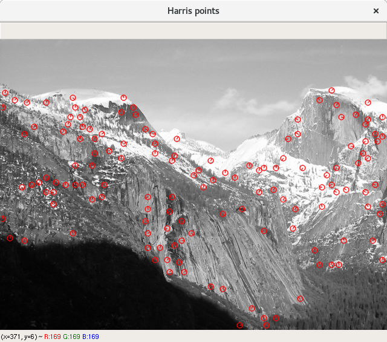
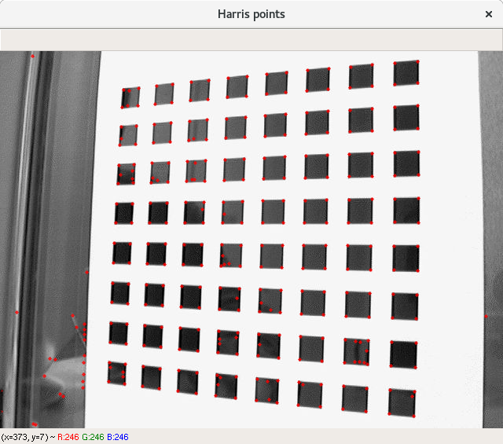

# VC - P3
## Miguel Lentisco Ballesteros

## Ejercicio 1

### Explicación y código

El ejercicio consiste en hacer un método para obtener los puntos Harris de una imagen, un método para extraer puntos significativos/relevantes de la imagen donde se encuentran las esquinas/bordes.

Se basa en la obtencción del "cambio" de velocidad del gradiente en un punto de la imagen, para ello se toma el vector gradiente en un punto de la imagen y se multiplica por si mismo transpuesto, obteniendo una matriz de dimensiones 2x2. Hay distintos métodos para determinar la función que estima lo interesante del punto, en nuestro caso usamos el operador Harris (lambda_min).

Seguiremos el método que sugieren en el paper [http://matthewalunbrown.com/papers/cvpr05.pdf], con sus valores de parámetros considerados. Aplicaremos el método a una pirámide Gaussiana para detectar puntos a distintas escalas.

El método `harris_points_detector` nos imprimirá por cada escala los puntos relevantes en la imagen original, con el tamaño de los puntos a escala adecuada. Probabremos con una foto `Yosemite1` y `Tablero1`, con 4 niveles (el 0 cuenta como la imagen original).

1. Primero obtenemos una pirámide Gaussiana y a continuación a cada nivel de la pirámide aplicamos los siguientes pasos.

  ```python
  # Obtenemos la pirámide gaussiana
  gaussian_pyr = get_gaussian_pyr(img, pyr_levels)
  ```

2. Obtenemos la función "corner strength" (operador Harris) en cada punto de la imagen.

  Para ello tenemos `get_corner_strength`: aplicamos como sugiere el paper una gaussiana de escala 1.5 y otra de 1.0. Obtenemos la matriz 2x2 mencionada anteriormente con la función de OpenCV `cornerEigenValsAndVecs` con `blockSize` 3, este bloque permite tomar un entorno del punto para tomar la matriz. Esta matriz no es más que la matriz de covarianzas de la derivada en un entorno de tamaño `blockSize`.

  Nos quedamos con las primeros 2 valores (los valores propios) y ahora procedemos a aplicar la fórmula que consiste en f = (lambda_1 * lambda_2) / (lambda_1 + lambda_2), siendo lambda_i los valores propios de la matriz 2x2; siento esta fórmula la media armónica de los valores propios. Cuando f sea muy alto nos dice que las direcciones asociadas a los valores propios son altos, es decir hay una esquina.

  Hacemos la división de manera que si el denominador es 0, ponemos a 0 el valor en ese punto.


  ```python
  # Obtenemos los valores propios de la matriz de covarianzas
  # de las derivadas del entorno para cada pixel
  eigenVals = cv2.cornerEigenValsAndVecs(img_g2, blockSize, ksize)[:, :, :2]
   # Obtenemos el operador Harris: lambda_1 * lambda_ 2 / (lambda_1 + lambda_2)
  eigen1 = eigenVals[:, :, 0]
  eigen2 = eigenVals[:, :, 1]
  eigenMul = eigen1 * eigen2;
  eigenSum = eigen1 + eigen2;
  # Ponemos a 0 cuando la suma sea 0 (ignoramos el punto)
  return np.divide(eigenMul, eigenSum, out = np.zeros_like(eigenMul),
                    where = eigenSum != 0)
  ```

3. Ahora pasamos thresholding a los valores obtenidos, de manera que ponemos a 0 todos los puntos que tengan un valor que no supere el umbral. En el paper se nos sugiere que pongamos el umbral a 10.0.

  ```python
  # Aplicamos thresholding
  interest_points[interest_points < 10.0] = 0.0
  ```

4. Al resultado aplicamos supresión de no-máximos, este método consiste en ir pasando una ventana/entorno por la imagen y dejar a 0 los píxeles de la imagen que no son el máximo en ese entorno. El tamaño del entorno lo dejamos a 3, para evitar suprimir entornos grandes, y también es lo que se nos sugiere en el paper.

  Con `non_maximum_suppresion` se implementa esto.

  ```python
  # Imagen resultado
  res = np.zeros_like(img)
  # Por cada píxel
  for i, j in np.ndindex(img.shape):
    # Radio ventana
    r = window_size // 2
    # Tomamos el entorno 3x3 del píxel (cuando se pueda)
    window = img[max(i - r, 0):min(i + r + 1, img.shape[0]),
                        max(j - r, 0):min(j + r + 1, img.shape[1])]
    # Añadimos el punto si es el máximo de su entorno
    if (np.max(window) == img[i, j]):
      res[i, j] = img[i, j]
  return res
  ```

5. Ya hemos obtenido los puntos Harris, ahora vamos a transformarlos en `KeyPoint` para poder dibujarlos en la imagen original y visualizarlos. Para ello necesitamos saber su posición (sus índices en la imagen), su escala (nivel de la pirámide por el tamaño de bloque que fijamos a 3 en `get_corner_strength`; y finalmente la orientación (gradiente) del punto.

  La escala es fácilmente conseguible con `scale = BLOCKSIZE * (i + 1)` (incrementamos en 1 el nivel de pirámide para que no sea 0 a nivel 0), y la orientación la obtendremos con `get_angles`.

  Calcularemos la orientación de los puntos que no tengan valores nulos, obtenemos los índices con `points_index = np.nonzero(interest_points)`.


6. Para calcular la orientación, calcularemos el gradiente, antes aplicando una gaussiana de escala 4.5 que recomienda el paper. Una vez tenemos el gradiente (derivada en eje X, derivada en eje Y) podemos usar la función de OpenCV `phase` para obtener el ángulo (en grados) en cada punto.

  ```python
  # Obtenemos el ángulo (orientación)
  cv2.phase(dx.flatten(), dy.flatten(), angleInDegrees = True)
  ```

7. Ahora creamos los keypoints, poniendo las coordenadas respecto la imagen original, para ello multiplicaremos por `2 ** i` donde `i` es el nivel actual de la pirámide; aunque la imagen no sea justo una potencia de `2`, el error mínimo que se pueda cometer se rectifica con el tamaño de la escala del punto.

  ```python
  # Formamos los keypoints
  keypoints = []
  for y, x, angle in zip(points_index[0], points_index[1], angles):
    keypoints.append(cv2.KeyPoint(x * 2 ** i, y * 2 ** i, scale, angle))
  ```

8. Imprimimos la imagen original con los keypoints usando la función `drawKetpoints`, además imprimimos el nº de puntos obtenidos el nivel.

  ```python
  # Nº de puntos por nivel
  print("Nivel", i, ", nº de puntos:", len(keypoints))
  # Dibujamos los keypoints
  image_points = cv2.drawKeypoints(img_original, keypoints, None,
                     color = (0, 0, 255),
                     flags = cv2.DRAW_MATCHES_FLAGS_DRAW_RICH_KEYPOINTS)
  # Imprimimos el resultado
  show_image("Harris points", image_points)
  ```

  Pintamos de rojo los círculos de los puntos, y usamos el flag `DRAW_MATCHES_FLAGS_DRAW_RICH_KEYPOINTS` para que se impriman los círculos con el radio respecto a su escala y además que se muestre la orientación del punto también.

9. Además veremos como podemos refinar la obtención de puntos en bordes, corrigiendo los que hemos obtenido a preicisón decimal. Conseguimos estos puntos con `get_corrected_points`

  ```python
  WINSIZE = (5, 5)
  # Región muerta- nada
  ZEROZONE = (-1, -1)
  # Criterio de parada
  CRITERIA = (cv2.TERM_CRITERIA_MAX_ITER + cv2.TERM_CRITERIA_EPS, 50, 0.01)
  # Obtenemos los subpixels corregidos de los keypoints
  corrected_points = keypoints.astype("float32").reshape(-1, 2)
  return cv2.cornerSubPix(img, corrected_points, WINSIZE, ZEROZONE, CRITERIA)
  ```

  Con `conerSubPix` obtenemos este refinamiento de los keypoints, en este método usamos una ventana de tamaño 11x11 para que pueda buscar la mejoría en el entorno de 10x10 que se nos pide, no activamos `zero_zone` para que no ignore ninguna zona, y ponemos como criterio de parada hasta 50 iteraciones o que no mere al menos 0.01.

10. Ahora cogeremos 3 keypoints aleatorios cuyos valores no coincidan con los corregidos (se han obtenido mejores) y mostraremos tomando un zoom x5 de la imagen orignal y un entorno de 10x10 dibujando con círculos el keypoint original y el corregido.

  En `show_corrected_corners` lo vemos:

  ```python
  # Puntos elegidos
  chosen_points = []
  # Hasta que tengamos 3
  index = np.arange(corrected_points.shape[0])
  while len(chosen_points) < 3:
      # Escogemos un índice aleatorio
      i = np.random.choice(index, 1, replace = False)
        #print(corrected_points[i, 0], keypoints[i, 0])
      if (corrected_points[i, 0] != keypoints[i, 0] or
            corrected_points[i, 1] != k):
          chosen_points.append(i)
  ```

  Obtenemos los 3 puntos distintos aleatorios, y ahora procedemos a mostrarlos por pantalla según la explicación anterior.

  ```python
  ZOOM = 5
  for p_index in chosen_points:
      # Cogemos los puntos
      x_k = int(keypoints[p_index, 0])
      y_k = int(keypoints[p_index, 1])
      x_c = int(corrected_points[p_index, 0])
      y_c = int(corrected_points[p_index, 1])
      # Para color
      img = cv2.cvtColor(img_orig, cv2.COLOR_GRAY2BGR)
      # Hacemos zoom x5
      img = cv2.resize(img, None, fx = ZOOM, fy = ZOOM)
      # Pintamos un círculo rojo en el punto original
      img = cv2.circle(img, (ZOOM * y_k, ZOOM * x_k), 4, (0, 0, 255))
      # Pintamos un círculo verde en el punto corregido
      img = cv2.circle(img, (ZOOM * y_c, ZOOM * x_c), 4, (0, 255, 0))
      # Imprimimos el entorno 10x10 del punto original
      window = img[max(ZOOM * (x_k - 5), 0):min(ZOOM * (x_k + 5),
                   ZOOM * img.shape[0]), max(ZOOM * (y_k - 5), 0) :
                   min(ZOOM * (y_k + 5), ZOOM * img.shape[1])]
      # Mostramos
      show_image("", reescale_uint8(window))
  ```

  Hacemos el zoom, y dibujamos los círculos, uno rojo para el keypoint original y otro verde para el punto corregido (el centro se toma como los puntos multiplicados por 5 para tomar en cuenta el zoom); finalmente se toma el entorno de 10x10 (cuando se pueda) y se imprime.

### Resultados y valoración

Se han obtenido los puntos para las imagenes Yosemite1 y Tablero1, con 4 niveles de pirámide gaussiana. Los resultados obtenidos a distintas escalas son los siguientes:

- Yosemite





- Tablero



Vemos como en cada nivel se van obteniendo menos puntos, desde el principio se obtienen muchos puntos (del orden de 2k puntos) y conforme bajamos se obtienen menos y menos. Vemos como se observan los picos correctamente a cada nivel, observándose una reepresentación a cada escala.

En el caso de Yosemite en las nubes, los picos, las faldas... pero en Tablero podemos ver como se notan más reconcoiendo todas las esquinas de los cuadrados negros, y conforme bajamos de nivel se van creconociendo los centros de los cuadrados negros, los laterales... por lo que podemos notar que reconoce bien las equinas y bordes de la imagen y a cada escala.

Los puntos obtenidos en Yosemite no superan los 3.5K por lo que tenemos muchos puntos pero no nos pasamos teniendo una barbaridad:

```
EJERCICIO1: Detector de Puntos Harris
Harris detector, 4 levels
Nivel 0 , nº de puntos: 2826
Nivel 1 , nº de puntos: 585
Nivel 2 , nº de puntos: 140
Nivel 3 , nº de puntos: 51
Nivel 4 , nº de puntos: 17
```

Podemos ver como con los parámetros aconsejados por el paper dan resultado en nuestras imágenes correctamente.

Ahora veamos los puntos corregidos, en tablero donde tenemos los bordes mejor definidos podemos notar más las diferencias que en Yosemite donde los bordes no están tan definidos con zoom x5.

- Tablero:


- Yosemite:


EN el caso de Yosemite acerca el punto a ciertos bordes que hay cercanos, pero los bordes con este zoom no están muy claros, si que es cierto que se acercan pero no se con exactitud. En el caso de Tablero notamos fácilmente que los puntos corregidos se acercan a los bordes claramente (zonas más oscuras) corrigiendo el pequeño desvío de los puntos obtenidos.

Por tanto notamos la ventana que puede ser usar este método para obtener una precisón máxima de los keypoints de los bordes/esquinas, que queda clara en estos resultados.

Se empezó con la ventana de tamaño 7x7 pero se aumentó a 11x11 para que se vea claro que busque el borde por todo el entorno 10x10.

## Ejercicio 2

### Explicación y código

En este ejercicio tendremos que usar los descriptores del método AKAZE para poder comparar imágenes que contienen vistas (objetos, paisajes, cambio de perspectiva...) en común. Buscaremos descriptores comunes en ambas imágenes para poder establecer esta correspondencia y mostraremos en las imagenes las conexiones.

Podemos dibujar esto con `draw_matches_akaze`.

1. Obtenemos los keypoints y descriptores AKAZE de dos imagenes que se den con `get_keypoints_descriptors_akaze`, creamos el objeto `akaze` y con `detectAndCompute` los obtenemos.

  ```python
  # Creamos AKAZE
  akaze = cv2.AKAZE_create()
  # Obtenemos keypoints y descriptores
  return akaze.detectAndCompute(img, None)
  ```

2. Ahora necesitamos un método para hacer match entre los descriptores de las dos imagenes, para ello podemos usar el método de `BruteForce + CrossCheck` o el método sugerido por Lowe `Lowe-Average-2nn`.

  El primer método lo implementamos fácilmente con el objeto `BFmatcher_create` y la opción `crossCheck` activada.

  ```python
  bf = cv2.BFMatcher_create(cv2.NORM_HAMMING, crossCheck = True)
  # Hacemos los matches
  return bf.match(desc1, desc2)
  ```

  El método de Lowe, primero con `knnMatch`, `k = 2`, tenemos los mejores 2 matches, y después se cogen los matches cuaya distancia esté a 0.75 del resto. Este valor de 0.75 está en el intervalo `[0.7, 0.8]` que se recomienda en el paper, donde se miran valores para minimizar los falsos positivos y maximizar los aciertos.

  ```python
  # Creamos BF con norma Hamming
  bf = cv2.BFMatcher_create(cv2.NORM_HAMMING)
  # Hacemos matches con knn, k = 2
  matches = bf.knnMatch(desc1, desc2, k = 2)
  # Aplicamos ratio test
  good_matches = []
  for m,n in matches:
    if m.distance < 0.75 * n.distance:
      good_matches.append(m)
  return good_matches
  ```

  En ambos casos usamos la métrica/distancia `cv2.NORM_HAMMING` que es la norma usada para descriptores binarios, que devuelve AKAZE por lo que usamos esta métrica.

3. Sea cual sea el método usado, escogemos 100 matches aleatoriamente y los dibujamos en la imagen con `img_matches`. Se activa el flag `DRAW_MATCHES_FLAGS_NOT_DRAW_SINGLE_POINTS` para imprimir solo los matches que se pasan.

```python

# Obtenemos los keypoints y descriptores AKAZE
kpts1, desc1 = get_keypoints_descriptors_akaze(img1)
kpts2, desc2 = get_keypoints_descriptors_akaze(img2)
# Obtenemos los matches con el método dado
matches = bf_match_method(desc1, desc2)
# Tomamos 100 matches aleatorios)
matches = np.random.choice(matches, min(len(matches), 100), replace = False)
# Mostramos los matches
img_matches = cv2.drawMatches(img1, kpts1, img2, kpts2, matches, None,
                      flags = cv2.DRAW_MATCHES_FLAGS_NOT_DRAW_SINGLE_POINTS)
show_image("Matching imgs", img_matches)

```

### Resultados y valoración

Probamos con las dos parejas Yosemite y Tablero, tanto en color como en gris, usando en los grises `match_brute_force_cross_check` y en color `match_lowe_average_2nn`.

- BF + CC


- Lowe-2nn


- BF + CC


- Lowe-2nn


- BF + CC


- Lowe-2nn


- BF + CC


- Lowe-2nn


Podemos observar entre los métodos usados, que `BF + CC` obtiene descriptores de puntos más alejados que `Lowe-2nn`, se puede observar claramente en Yosemite donde a la izquierda se cogen puntos más alejados. Además estos puntos alejados son falsos positivos puesto a partir de la falda de la montaña no se comparten más puntos. Sin embargo en Tablero donde tenemos el mismo patrón repetido (los cuadrados) decree mucho los matches obtenidos con `Lowe-2nn`, cosa que no le pasa a `BF+CC`.

Por tanto tenemos que `BF+CC` funciona peor en Yosemite (falsos positivos) que `Lowe-2nn`, pero en Tablero `BF+CC` consigue bastantes matches mientras que `Lowe-2nn` no.

En cuestión de color no se observan diferenciasr reseñables.

Además vemos que los matches de `Lowe` produce conexiones más paralelas entre sí que `BF+CC` que tiene líneas cruzadas, algunas en osemite y más se nota en Tablero; esto puede ser una mejoría para que la homografía no tenga que realizar transformaciones muy raras.


## Ejercicio 3

### Explicación y código

En este ejercicio aprovecharemos los matches que obtenemos entre imagenes que comparten zonas; en concreto vamos a querer realizar un mosaico con dos imágenes. Estas dos imágenes generalmente van a compartir por ser dos imágenes tomadas moviendose horizontalmente/verticalmente pero conservando elementos en común.

Para ello el método `draw_2_mosaic` nos devuelve el mosaico formado con las dos imagenes y un método que le digamos para obtener los matches de los descriptores.

1. Primero creamos un canvas (lienzo) suficientemente grande para poder formar el mosaico dentro. Usaremos como referencia la primera imagen que colocaremos en el centro.

  Para ponerla en el centro, usaremos una homografía que permite trasladar los puntos de una imagen a otra; no es más que una matriz de 3x3 aplicada a los puntos de una imagen.

  Formando un canvas con dimensiones un poco mayores que la imagen base y usamos el fondo negro.

  ```python
  # Nº de canales
  channels = 3 if len(img.shape) > 2 else 1
  # Creamos el lienzo
  (h, w, c) = (round(img.shape[0] * 2.2), round(img.shape[1] * 3.2), channels)
  canvas = np.zeros((h, w, c), dtype = "uint8")
  ```

  A continuación obtenemos las esquinas de la imagen base y la esquina del bloque del centro del canvas donde vamos a ponerla, podemos conseguirlo con `get_corners`. Ahora estimamos la homografía de los puntos de la imagen base hacia el canvas.

  ```python
  # Obtenemos los puntos para hacer la homografía
  puntos_img = get_corners(img)
  puntos_canvas = get_corners(img, w // 2.7, h // 4)
  # Hacemos la homografía
  H_canvas = cv2.findHomography(puntos_img, puntos_canvas, cv2.RANSAC)[0]
  ```
  No es exactamente el centro pero los valores se han ajustado para que cuadren todas los mosaicos realizados (por ejemplo las imagenes no van a ser movidas verticalmente, pero si mucho horizontalmente).

  La matriz H_canvas nos permite pasar la imagen al canvas, mediante la función de OpenCV `warpPerspective`, teniendo en cuenta que hay que invertir las coordenadas, y poner el flag `cv2.BORDER_TRANSPARENT` para que no haga interpolación y deje como estaban los puntos del canvas donde no se aplica la transformación.

2. Ahora buscamos la homografía entre la segunda imagen y la primera imagen, con la función `get_homography`. Aquí obtenemos los keypoints y descriptores de Akaze y realizamos el match con el método que le indiquemos. Finalmente estimamos la homografía entre los puntos de los match de cada imagen.

  ```python
  # Extraemos los keypoints y descriptores AKAZE
   kpts1, desc1 = get_keypoints_descriptors_akaze(img1)
   kpts2, desc2 = get_keypoints_descriptors_akaze(img2)
   # Obtenemos los matches con el metodo proporcionado
   matches = bf_match_method(desc1, desc2)
   # Sacamos las coordenadas de los matches en cada imagen
   scene = np.float32([kpts1[match.queryIdx].pt for match in matches])
   obj = np.float32([kpts2[match.trainIdx].pt for match in matches])
   # Estimamos la homografía
   return cv2.findHomography(obj, scene, cv2.RANSAC, 1)[0]
   ```

3. Finalmente tenemos que proyectar la imagen sobre el canvas, juntando las partes iguales con la otra imagen. Para esto solo tenemos que pasar los puntos de la segunda imagen a la primera, y usando la homografía de la primera a la imagen hacia el canvas obtenemos lo que queríamos (realizamos una composición de funciones: multiplicación de matrices).

  ```python
  H = get_homography(img1, img2, bf_match_method)
   # Juuntamos img2 en el lienzo
   canvas = cv2.warpPerspective(img2, np.dot(H_canvas, H), (w, h), dst = canvas,
                                    borderMode = cv2.BORDER_TRANSPARENT)
   # Mostramos
   show_image("Mosaico", canvas)
   ```

  Con `dot` realizamos la composición de las funciones/multiplicación de matrices de homografaías; y usamos `warpPerspective` como hicimos con el canvas y la imagen1.

### Resultados y valoraciones

Probamos con las dos imagenes Yosemite porque vemos claramente que comparten una región y lo vemos en gris y color. No probamos con los Tableros puesto que son dos imagenes con perspectivas muy parecidas del mismo tablero y no conseguiriamos unirlas correctamente (en el ejercicio2 veiamos las correspondiencias se cruzaban mucho).

Imprimimos Yosemite grises con `Lowe` y en colores con `BF+CC`:

- Grises + Lowe


- Colores + BF+CC


Vemos que en ambos casos el mosaico resultante es de gran calidad, podemos ver donde se unen las fotos pero el resultado queda muy compacto, tanto con el método `Lowe` como con `BF+CC`; en ambos casos las correspondiencias no tenían muchas líneas cruzadas y se puede realizar la homografía correctamente (veremos en el ejercicio4 que hay alguna panorámica más difícil).

Notamos que la imagen derecha se tuerce un poco al final para hacer que la imagen se vea plana, notando la desviación de la imagen que tiene.

En este ejercicio se ha experimentado el tamaño del canvas, y de la posición del centro para adecuarlo para que se vea bien el mosaico.


## Ejercicio 4

### Explicación y código

Ahora tenemos que realizar mosaicos pero en vez de 2 imágenes de muchas más. Para ello primero consideramos usar una imagen central que proyectar en el canvas, y después ir añadiendo cada imagen a los lados.

Para esto requerimos que las imágenes compartan zonas y que estén ordenadas de izquierda a derecha según estas zonas.

Solo tenemos que pasarle las imágenes y el método de matcheo a `draw_full_mosaic`, donde hacemos lo siguiente.

1. Tomamos la imagen central y la proyectamos sobre el canvas, obteniendo el canvas con la imagen y la homografía para proyectar desde la imagen central hacia el canvas.

  Es lo mismo que haciamos en el ejercicio3 con `create_canvas`.

  ```python

  center_index = len(imgs) // 2
  img_centro = imgs[center_index]
  # Formamos el canvas con él
  canvas, H_canvas = create_canvas(img_centro)
  (h, w) = canvas.shape[:2]
  ```

2. Ahora realizamos las homografías para cada pareja de imagenes adyacentes, considerando que tenemos que tenemos que cambiar coordenadas según estemos a la izquierda o derecha del centro, A la izquierda del centro, tenemos que cambiar coordenadas de la imagen izquierda hacia la derecha; a la derecha del centro al revés, desde la izquierda hacia la derecha.

  ```python
  # Obtenemos las homográfias entre cada par de imagenes
  homographies = []
  # Parte izquierda
  for i in range(center_index):
      homographies.append(get_homography(imgs[i+1], imgs[i], bf_match_method))
  # Parte derecha
  for i in range(center_index, len(imgs) - 1):
      homographies.append(get_homography(imgs[i], imgs[i+1], bf_match_method))
  ```

3. Finalmente tenemos que proyectar cada imagen hacia el canvas, para ello empezamos desde el centro y vamos haciendo encadenando hacia cada lado la composición de funciones con la homografía del canvas y las que hemos obtenido con cada pareja. Así con `warpPerspective` imprimimos la imagen en el canvas unida con las imagenes.

  ```python
  # Parte derecha
   H_right = np.copy(H_canvas)
   for i in range(center_index, len(imgs) - 1):
     # Composición
     H_right = np.dot(H_right, homographies[i])
     # Uno
     canvas = cv2.warpPerspective(imgs[i + 1], H_right, (w, h), dst = canvas,
                                   borderMode = cv2.BORDER_TRANSPARENT)
   # Parte izquierda
   H_left = np.copy(H_canvas)
   for i in range(center_index, 0, -1):
     # Composición
     H_left = np.dot(H_left, homographies[i - 1])
     # Uno
     canvas = cv2.warpPerspective(imgs[i - 1], H_left, (w, h), dst = canvas,
                                   borderMode = cv2.BORDER_TRANSPARENT)

   # Imprimimos el mosaico
   show_image("Full mosaic", canvas)
   ```

   Al fin y al cabo lo que estamos realizando es una cadena de composiciones de funciones, aprovechando empezando desde el centro hacia cada extremo respectivamente.

  ### Resultados y valoraciones

  Para los mosaicos completos tomaremos el de la ETSIIT completo (10 imágenes) puesto que todas son imagenes consecutivas; y las de Yosemite_full de la 1 a la 5; y la 6 a la 8 puesto que los dos tramos no comparten entre sí nada.

  El método para hacer match se ha usado `Lowe` puesto que con `BF+CC` había efectos debido a que los matches se cruzaban provocando que la imagen se deformase mucho, en algunos casos dejandola irreconocible. Por tanto `Lowe` ha producido mosaicos de panorámicas completamente correctas y se ha quedado como el método a realizar.

  - Yosemite6-8 gris
  

  - Yosemite6-8 color
  

  - Yosemite1-5 gris
  

  - Yosemite1-5 color
  

  - Etsiit gris
  

  - Etsiit color
  

Observamos como todas la panorámicas se juntan correctamente, tanto en color como en grises. También se puede ver como las imagenes se tuercen un poco para que la imagen intente quedar plana como si fuese de una misma perspectiva; en el caso de Yosemite6-8 donde la primera imagen (por la izquierda) queda mas deformada y echada como hacia atrás.

En Yosemite6-8 la primera imagen es la que provocaba más problemas con el matching, con `BF+CC` provocaba que hubiera una transformación que rompía la imagen (ruido) por los matches que hacia no solo en el lado que estaba unido con la otra imagen, si no por la otro lado fastidiando todo el mosaico; se nota que este mosaico es el más difícil de construir, el resto es más facil por tener zonas más claramente diferenciadas y las fotos tomadas con más continuidad y moviendose ligeramente horizontalmente o verticalmente.

Además incluso con `Lowe` había que ajustar el valor asociado a RANSAC, estuve provando con el valor por defecto `3` pero hasta que no lo puse en `1` no conseguí que se ajustara correctamente las imagenes (en caso de `BF+CC` ni así, por eso se queda `Lowe`).
